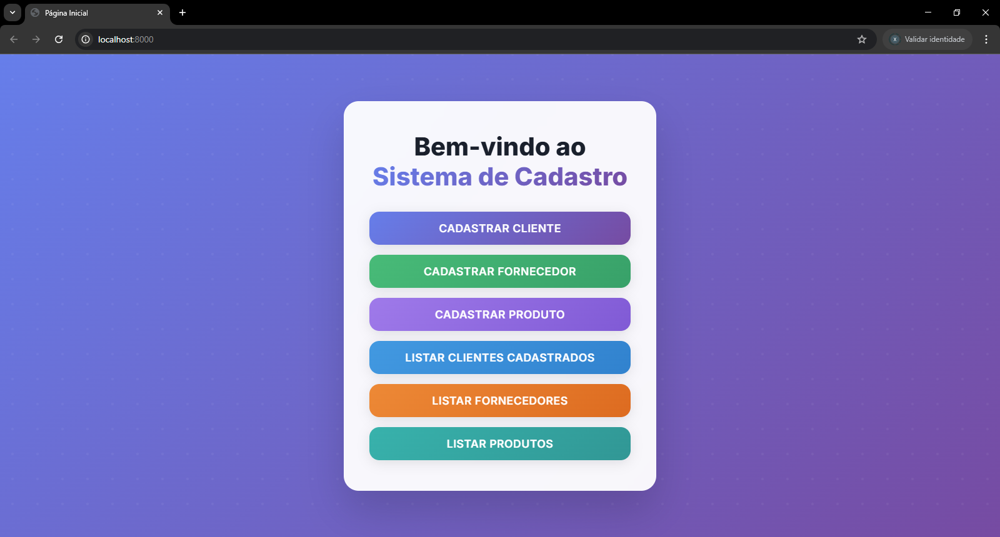

📸 Tela Página Inicial


# Sistema de Cadastro (Clientes, Fornecedores, Produtos)

Este é um sistema simples de cadastro de **clientes**, **fornecedores** e **produtos**, desenvolvido em PHP puro com padrão **MVC** (Model - View - Controller), sem frameworks externos.

## 📁 Estrutura de Pastas
/sistema_cadastro
├── config/ # Configuração de conexão com o banco
├── data/ # Dump do banco (ex: .sql)
├── public/ # Raiz pública da aplicação (acessada pelo navegador)
│ └── index.php # Ponto de entrada do app
├── src/
│ ├── app/ # Router e lógica principal
│ ├── controllers/ # Controllers
│ ├── models/ # Models
│ └── views/ # Views (HTML + PHP)
├── .htaccess # Redireciona requisições para public/index.php
├── composer.json # (caso use dependências)
└── README.md
---

## ✅ Pré-requisitos

- PHP >= 7.4
- MySQL ou MariaDB
- Servidor local (como XAMPP, Laragon, WAMP ou o PHP embutido)
- Navegador

---

## ⚙️ Como rodar o projeto

### 1. Clone o repositório
```bash
git clone https://github.com/Xandre23/Teste-pratico.git
cd sistema_cadastro

3. Configure a conexão no arquivo:
config/database.php

4. Suba o servidor local
Você pode usar o servidor embutido do PHP:
php -S localhost:8000 -t public

Ou usar seu ambiente local (XAMPP, Laragon, etc), apontando para a pasta public/.
http://localhost:8000

🛠 Funcionalidades
✅ Cadastrar, listar, editar e deletar clientes

✅ Cadastrar, listar, editar e deletar fornecedores

✅ Cadastrar, listar, editar e deletar produtos

✅ Interface simples com Bootstrap

✅ Organização com padrão MVC

🧑‍💻 Autor
Desenvolvido por Xandre De Paula
💼 Projeto para vaga de estágio e para fins de estudo.
